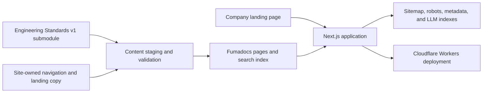

<p align="center">
  <a href="https://www.litenova.solutions">
    
  </a>
</p>

<h1 align="center">Litenova Solutions Public Site</h1>

<p align="center">
  Next.js application for the Litenova Solutions company landing page and the published
  Engineering Standards v1 documentation.
</p>

<p align="center">
  <a href="https://github.com/Litenova-Solutions/Litenova.Solutions-Public-Site/actions/workflows/ci.yml"></a>
  <a href="https://www.litenova.solutions"></a>
  <a href="https://www.litenova.solutions/Standards"></a>
  <a href="https://developers.cloudflare.com/workers/"></a>
  <a href="LICENSE"></a>
</p>

<p align="center">
  <a href="https://www.litenova.solutions">Website</a> |
  <a href="https://www.litenova.solutions/Standards">Engineering Standards</a> |
  <a href="CONTRIBUTING.md">Contributing</a> |
  <a href="SECURITY.md">Security</a>
</p>

## Overview

One application serves the company site and the public Engineering Standards documentation from
the canonical `https://www.litenova.solutions` origin.

| Surface | Route | Source |
| --- | --- | --- |
| Company landing page | `/` | `app/(site)` and `components/marketing` |
| Engineering Standards v1 | `/Standards` | Released standards submodule, site overrides, and Fumadocs |
| Privacy notice | `/privacy` | Site-owned reference content |
| Accessibility statement | `/accessibility` | Site-owned reference content |
| Search and agent discovery | `/sitemap.xml`, `/robots.txt`, `/llms.txt`, `/llms-full.txt` | Generated during the build |

The apex domain redirects to the `www` origin. Canonical metadata, structured data, the sitemap,
the robots policy, and the generated LLM indexes use that origin in local, preview, and production
builds.

## Build Model



Normative content comes from the
[Engineering-Standards](https://github.com/Litenova-Solutions/Engineering-Standards) Git
submodule. The submodule is pinned to the published `v1.0.0` tag at commit
`ca022abebd1d74d7b73c2c2e159f71418ec2a00c`. It does not follow the standards repository default
branch.

The build copies the released documentation into `.standards-src`, applies site-owned navigation
metadata, rewrites internal links, validates staged routes, and generates the two LLM indexes.
Generated content is not committed.

## Technology

| Component | Version or Role |
| --- | --- |
| Next.js | 16.2.10, application routing and rendering |
| React | 19.2.7, user interface composition |
| Fumadocs | Documentation layout, navigation, and static search |
| Tailwind CSS | 4.3.3, site and documentation styling |
| TypeScript | 6.0.3, strict type checking |
| Vitest | Unit tests |
| Playwright and axe-core | Browser journeys and accessibility checks |
| vinext | Cloudflare Workers adapter for Next.js |
| Wrangler | Worker configuration, validation, and deployment |
| Cloudflare Workers | Preview and production hosting |

The preferred runtime is Node.js 24.16.0, recorded in `.node-version`. The package accepts Node.js
24 patch releases from 24.11.0 and uses pnpm 11.13.1 through Corepack.

## Repository Layout

| Path | Responsibility |
| --- | --- |
| `app/(site)/` | Company landing page, privacy notice, and accessibility statement |
| `app/Standards/` | Fumadocs layout, routes, and static search endpoint |
| `components/marketing/` | Company landing-page sections |
| `components/standards/` | Standards landing and documentation footer |
| `engineering-standards/` | Pinned standards submodule; do not edit here |
| `standards-overrides/` | Site-owned navigation metadata and standards landing copy |
| `scripts/stage-standards-docs.mjs` | Standards staging, link validation, and LLM index generation |
| `scripts/validate-site.mjs` | Release pin, metadata, text, and security validation |
| `tests/e2e/` | Browser, discovery, responsive-layout, and accessibility checks |
| `docs/MAINTAINER.md` | Content, release, and deployment runbook |
| `AGENTS.md` | Durable content, presentation, and verification rules for agents |

## Local Development

Clone the repository with its standards submodule and install the locked dependencies:

```bash
git clone --recurse-submodules git@github.com:Litenova-Solutions/Litenova.Solutions-Public-Site.git
cd Litenova.Solutions-Public-Site
corepack enable
pnpm install --frozen-lockfile
pnpm dev
```

If the repository was cloned without submodules, initialize them before running a build:

```bash
git submodule update --init --recursive
```

Open `http://localhost:3000` for the company site and `http://localhost:3000/Standards` for the
documentation. Open documentation search from the Fumadocs navigation or with `Ctrl+K`.

## Commands

| Command | Purpose |
| --- | --- |
| `pnpm dev` | Stage standards content and start the development server |
| `pnpm run content:stage` | Refresh staged standards, validate links, and generate discovery files |
| `pnpm lint` | Run ESLint with zero warnings allowed |
| `pnpm type-check` | Stage content and run the TypeScript compiler without emitting files |
| `pnpm test` | Run unit tests with Vitest |
| `pnpm validate` | Validate the release pin, content, metadata, and source rules |
| `pnpm build` | Stage content and create the production Next.js build |
| `pnpm run check:vinext` | Check Next.js compatibility with vinext |
| `pnpm run build:vinext` | Stage content and build the Cloudflare Worker |
| `pnpm run start:vinext` | Run the built Worker locally with Wrangler |
| `pnpm run preview:vinext` | Upload a version for a Cloudflare preview URL |
| `pnpm run deploy:vinext` | Build and deploy the Worker to Cloudflare |
| `pnpm test:e2e` | Run Playwright journeys against the production build |
| `pnpm check` | Run linting, type checking, unit tests, validation, and the production build |

Install Chromium once before running the browser suite:

```bash
pnpm exec playwright install chromium
pnpm check
pnpm test:e2e
git diff --check
```

These are the release gates used by CI. Browser coverage includes public-route discovery, mobile
navigation, keyboard interaction, search semantics, security headers, and automated axe scans.

## Content Ownership

Site code and presentation changes belong in this repository. Shared company facts and canonical
URLs live in `lib/site.ts`; project URLs and maturity labels live in `lib/projects.ts`.

Normative standards changes belong in the Engineering-Standards repository. Publish and accept a
standards release before updating the submodule pointer here. Use `standards-overrides` only for
the public documentation shell, navigation metadata, and site-owned landing copy.

Generated `.standards-src`, `.source`, `standards-splash/body.md`, and `public/llms*.txt` files are
ignored. Do not add them to a commit.

## Deployment

Cloudflare Workers Builds creates a preview for pull requests and deploys `main` to the production
Worker. Git submodules must remain enabled.

| Setting | Value |
| --- | --- |
| Worker | `litenova-solutions-public-site` |
| Root directory | Repository root |
| Framework | Next.js with vinext |
| Node.js | 24.x |
| Install command | `pnpm install --frozen-lockfile` |
| Build command | `pnpm run build:vinext` |
| Production deploy command | `pnpm run deploy:vinext` |
| Preview deploy command | `pnpm run preview:vinext` |
| Production branch | `main` |
| Canonical domain | `www.litenova.solutions` |

Review the Cloudflare preview, desktop and mobile layouts, standards search, crawl endpoints, and
accessibility results before merging. The apex domain redirects to the canonical `www` origin in
Cloudflare DNS and redirect configuration.

Workers Free currently allows 100,000 requests per day and 10 ms of CPU time per invocation. Review
Worker analytics when traffic or runtime behavior changes. See the [Workers limits](https://developers.cloudflare.com/workers/platform/limits/).

See the [maintainer runbook](docs/MAINTAINER.md) for content ownership, standards release updates,
preview verification, production verification, and rollback steps.

## Contributing and Policies

Read [CONTRIBUTING.md](CONTRIBUTING.md) before opening a pull request. Report security issues
through [SECURITY.md](SECURITY.md), not a public issue.

Source code is available under the [MIT License](LICENSE). The Litenova name and marks are covered
by [TRADEMARK.md](TRADEMARK.md). Contributor conduct is governed by
[CODE_OF_CONDUCT.md](CODE_OF_CONDUCT.md).
